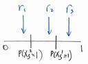

## 1

We are given the following Ising/Potts model
$$
\pi(X) = \frac{1}{Z} e^{\beta \sum_{<s,t>} 1(X_s = X_t)}
$$
We can use the method of induction to prove that $X_s^1 \geq X_s^2 \ \forall s$ at any given time; in other words, the sum of MC1 (the white chain) is always greater than or equal to the sum of MC2 (the black chain). By the premise of the problem, all sites in MC1 are initialized to 1 and all sites in MC2 are initialized to 0. Therefore, $X_s^1 \geq X_s^2 \ \forall s$ is satisfied in the base case. For the inductive step, the proposal probability of setting $X_s$ to 1 is 
$$
p(X_s=1) = \frac{e^{\beta \sum_{neighbors} 1(X_t = 1)}}{e^{\beta \sum_{neighbors} 1(X_t = 1)} + e^{\beta \sum_{neighbors} 1(X_t = 0)}}
$$
At each iteration (sweep), we generate a uniform random number, $r$, and we set the site to 1 if $r<p(X_s=1)$. Therefore, if the site has more neighbors with the value 1, the more likely that it will be set to 1. Since MC1 starts with more 1's than MC2 (consequently $p(X_s^1=1) > p(X_s^2=1)$), and due to the fact that both MC's share the same random number (i.e. the chains are coupled), we have the following cases for the values of $r$:



- For $r_1$, we set both $X_s^1$ and $X_s^2$ to 1.  
- For $r_2$, we set $X_s^1$ to 1 and $X_s^2$ to 0.  
- For $r_3$, we set both $X_s^1$ and $X_s^2$ to 0.  

As illustrated, the number of 1's will always be higher in MC1 than MC2 in any sweep because there will never be a case where $X_s^2$ is set to 1 when $X_s^1$ is set to 0 (i.e. if we set $X_s^2$ to 1, we also set $X_s^1$ to 1). Therefore, this partial ordering is preserved throughout the sweeps, hence $X_s^1 \geq X_s^2 \ \forall s$ at any given time. 

## 2 & 3

The code that generated the plots for 2 and 3 is shown below.

```{r}
require(grDevices)
library(ggplot2)
library(knitr)

# x is col, y is row
# output: neighbor 1st index is row (y), 2nd index is col (x)
findNeighbors = function(x,y,nrow,ncol) {
    
    # can only have a max of 4 neighbors 
    neighbors = matrix(0, nrow=4, ncol=2)

    # check top
    if ((y-1) > 0) {
        neighbors[1,2] = x
        neighbors[1,1] = y-1      
    } else { # wrap around
        neighbors[1,2] = x
        neighbors[1,1] = nrow
    }
    
    # check bottom
    if ((y+1) <= nrow) {
        neighbors[2,2] = x
        neighbors[2,1] = y+1
    } else { # wrap around
        neighbors[2,2] = x
        neighbors[2,1] = 1
    }
    
    # check left
    if ((x-1) > 0) {
        neighbors[3,2] = x-1
        neighbors[3,1] = y
    } else { # wrap around
        neighbors[3,2] = ncol
        neighbors[3,1] = y
    }

    # check right
    if ((x+1) <= ncol) {
        neighbors[4,2] = x+1
        neighbors[4,1] = y
    } else { # wrap around
        neighbors[4,2] = 1
        neighbors[4,1] = y
    }
    
    return(neighbors)
}


#############
# test case
#############
set.seed(1234567)
n=64
nrow = n
ncol = n
maxIter = 5000
minIter = 60 # for plotting
chain_sum = matrix(0, nrow=maxIter, ncol = 2)
betas = c(0.5, 0.65, 0.75, 0.83, 0.84, 0.85, 0.9, 1.0)
taus = matrix(0, nrow=length(betas), ncol=1)
diff_eps = 1e-6
ii = 1

for (beta in betas) {
    
    # re-initialize mc1 and mc2
    mc1 = matrix(1, nrow=n, ncol=n)
    mc2 = matrix(0, nrow=n, ncol=n)
    
    for (jj in 1:maxIter) {
        
        # print(jj)
        
        # update the MCs
        for (rr in 1:nrow) {
            for (cc in 1:ncol) {
                
                rand = runif(1)
                
                neighbors = findNeighbors(cc, rr, nrow, ncol)
                
                # Note: we are always doing the update wrt P(X_s = 1)
                
                # update MC1
                px1 = exp(beta * sum(mc1[neighbors] == 1))
                px0 = exp(beta * sum(mc1[neighbors] == 0))
                
                # proposal prob for X_s = 1
                transitionProb1 = min(1, px1/(px1+px0))
                
                if (rand < transitionProb1) {
                    mc1[rr,cc] = 1 # stay at 1
                } else {
                    mc1[rr,cc] = 0 # transition to new state
                }
                
                # update MC2
                px1 = exp(beta * sum(mc2[neighbors] == 1))
                px0 = exp(beta * sum(mc2[neighbors] == 0))
                
                # proposal prob for X_s = 1
                transitionProb2 = min(1, px1/(px1+px0))
                
                if (rand < transitionProb2) {
                    mc2[rr,cc] = 1 # transition to new state
                } else {
                    mc2[rr,cc] = 0
                }                 
            }
        }
        
        #     # show image at the current sweep
        #     par(mfrow=c(2,2))
        #     image(mc1*256)
        #     image(mc2*256)
        
        # record sum of the chains for plotting
        chain_sum[jj,1] = sum(mc1)
        chain_sum[jj,2] = sum(mc2)
        
        
        # check for termination criteria
        # give it 50 iterations more after coalesce to show convergence
        if (((chain_sum[jj,1] - chain_sum[jj,2]) < diff_eps) && (jj > minIter)) {
            
            ############
            # Problem 2
            ############
            df = data.frame(iter=rep(1:jj,2), sum=c(chain_sum[1:jj,1], chain_sum[1:jj,2]), 
                            mc=c(rep(1,jj), rep(2,jj)))
            df$mc = as.factor(df$mc)
            print(ggplot(df, aes(iter, sum, colour=mc)) + geom_line() + xlab("iterations") 
                  + ylab("sum of image") + 
                      ggtitle(paste0("beta = ", beta)))
            
            ############
            # Problem 3
            ############
            # record the coalesce time, tau, for each beta
            taus[ii] = min(which((chain_sum[,1] - chain_sum[,2]) < diff_eps))
            ii=ii+1
        
            break
        }
    }
}

############
# Problem 3
############
df2 = data.frame(t=taus[1:6], b=betas[1:6])
print(ggplot(df2, aes(x=b, y=t))+geom_line()+xlab("beta")+ylab("tau"))
kable(df2, col.names=c("tau", "beta"))
```

The chains did not converge within 5000 iterations for $\beta = 0.9, 1.0$. Therefore, only $\beta = 0.5, 0.65, 0.75, 0.83, 0.84, 0.85$ are plotted. At $\beta=0.84$, there is a significant slow down in the coalesce time, which corresponds to the phase transition.  
